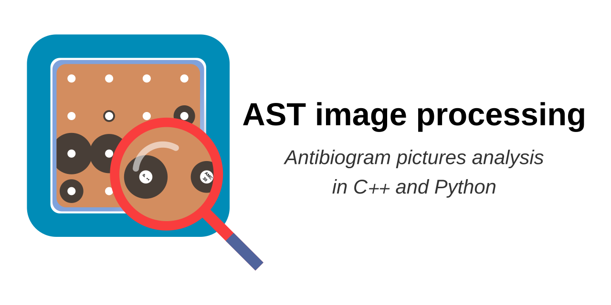

A library for processing and measuring Disk Diffusion Antibiotic Susceptibility Testing.
Its functions can measure the inhibition diameter in a picture of an inoculated Petri Dish.
The library can be used in C++ code or as a Python module.

# Installation and Quick Start
Please visit the [Quick Start Page](https://mpascucci.github.io/AST-image-processing/)

## Description
This image processing library contains functions to measures the inhibition diameters in the picture of a disk diffusion AST.

The image should be acquired according to [this protocol](https://mpascucci.github.io/ASTapp-protocol/)

## Project tree

```{}
|- astimp/              # astimp sources
   |- include/
      |- astimp_version.hpp.in   # contains astimp version
      |- astException.hpp  # custom astimp exception
      |- astimp.hpp        # main library header
      |- stand_labels.hpp  # headers for the generated label templates
  |- src/
      |- debug.hpp         # debug functions, not necessary build
      |- utils.cpp         # auxiliary functions used by the library
      |- astimp.cpp        # main astimp translation unit
|- docs/                   # [QuickStart](https://mpascucci.github.io/AST-image-processing/) page sources
|- python-module/          # python API code for astimp
      | - install_astimp_python_module.sh # install script fot the python module
|- tests/                  # test code
   |- example/             # full AST processing from picture to measurements
   |- images/              # test images
   |- include/             # tests level includes
      |- test_config.h     # contains a reference to the test image folder
   |- unit_tests/
      |- *.hpp             # astimp functions unit tests
      |- astimp_tests.cpp  # unit tests entry point
|- README.md               # this file
|- INSTALL_OPENCV.md       # install notes for OpenCV
```

## Detailed compiling and troubleshooting

### Build the library

If you want to build OpenCV from source, check `INSTALL_OPENCV.md`.
Run the `run-build.sh` script to build the library.

### Build targets
`make` is equivalent to `make all` and it will build all targets.

- `cd build` cd to build dir

- `make astimp` builds the library

- `make runUnitTests` builds the unit test executable

- `make fullExample` builds the full AST processing example

### Python API

To install `astimp` Python module, run `source ./install_astimp_python_module.sh` from `improc/python-module`.

Do not run `pip install` manually.

Re-run `source ./install_astimp_python_module.sh` whenever you want to bring new C++ changes into the python module.

#### Troubleshooting python
- You must use Python 3 and Numpy 1.7. On some systems, this might mean run `pip3` and `python3` above instead of `pip` or `python`.
- If you see `expected a readable buffer object`, make sure you're using numpy1.7.
- If you get `cannot open shared object file: No such file or directory` make sure that your `LD_LIBRARY_PATH` contains the path to `improc/build/astimplib` and the one to the `opencv` shared libraries in yout system (most likely `/usr/local/lib`). Then restart your terminal.
- If you get `...CMakeLists.txt does not match CMakeLists.txt used to generate cache`, `rm -rf build`.
- If you get `fatal error: 'cstddef' file not found #include <cstddef>` while building the python module's wheel, run the install script with `-s` flag, this will set `CFLAGS='-stdlib=libc++'`
- If anything does not update after install, rerun install with `-c` (clean) flag.
- `Using deprecated NumPy API` can be ignored.

### Run

- Run the unit tests the same way they are run by pipelines: `improc/ $ ./run-tests.sh`

- Run the full example: `improc/ $ ./build/tests/fullExample ./build/tests/test0.jpg`

- Run benchmarking: `improc/tests/benchmark$ sh ./benchmark.sh -d`. See also improc/tests/benchmark/README.md.

## Copyright and Licence

Copyright 2019 The ASTapp Consortium

Licensed under the Apache License, Version 2.0 (the "License");
you may not use this file except in compliance with the License.
You may obtain a copy of the License at

   <http://www.apache.org/licenses/LICENSE-2.0>

Unless required by applicable law or agreed to in writing, software
distributed under the License is distributed on an "AS IS" BASIS,
WITHOUT WARRANTIES OR CONDITIONS OF ANY KIND, either express or implied.
See the License for the specific language governing permissions and
limitations under the License.

Author: Marco Pascucci <marpas.paris@gmail.com>.
Principal contributors:
- Guillaume Boniface-Chang (antibiotic disks label)
- Ellen Sebastian (benchmark)
- Jakub Adamek (C++ Tests)
